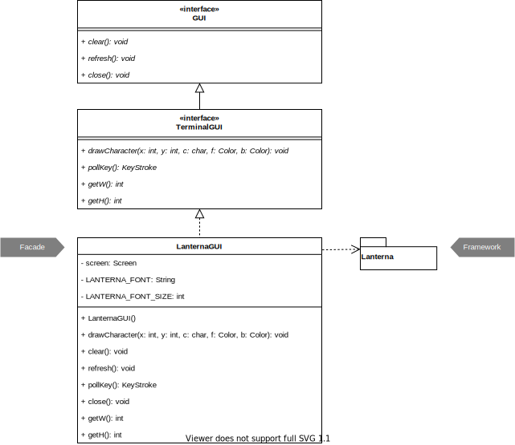
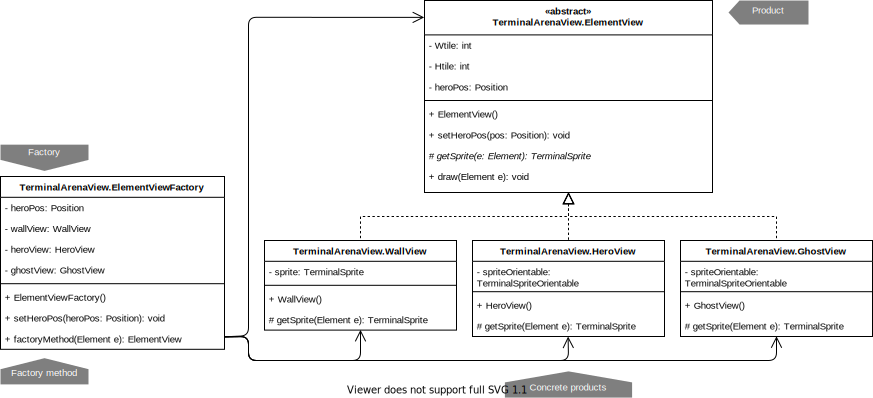
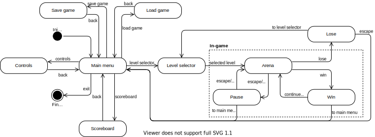
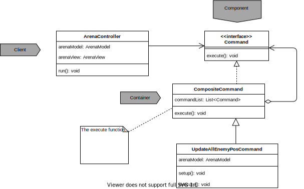

# LPOO_60 - The Cursed Catacombs
#### (Codename: pacman)

You are a noble knight seeking to assist Her Majesty in cleansing the capital's catacombs from the many monsters that inhabit it. Your mission is to kill all monsters and collect as many coins as possible across multiple levels.

This project was developed for LPOO 2019⁄20 by:
- [Diogo Rodrigues](https://github.com/dmfrodrigues) ([dmfrodrigues2000@gmail.com](mailto:dmfrodrigues2000@gmail.com)/[up201806429@fe.up.pt](mailto:up201806429@fe.up.pt))
- [João Matos](https://github.com/MechJM) ([up201703884@fe.up.pt](mailto:up201703884@fe.up.pt))

## Table of contents
1. [Description](#description)
    1. [Media](#media)
2. [Implemented features](#implemented-features)
3. [Planned features](#planned-features)
4. [Design](#design)
    1. [Lanterna facade](#lanterna-facade)
    2. [ElementView factory](#factory-elementview)
    3. [ViewFactory](#factory-view)
    4. [ArenaModelLoaderStream factory](#factory-arenamodelloaderstream)
    5. [Menus and games](#state-game)
    6. [ArenaController is the *God of Dynamics*](#command-composite-arenacontroller)
    7. [Movement strategies](#strategy-movement)
5. [Code smells and refactoring suggestions](#code-smells)
6. [Testing](#testing)
7. [Self-evaluation](#self-evaluation)

<a name="description"><a/>
## Description

Her Majesty the Queen has requested the assistance of a noble knight to cleanse the catacombs of the Kingdom's capital of the terrible monsters that have been haunting her subjects for centuries. Unfortunately, because people are scared of the monsters that occasionally escape the catacombs, productivity is low and the Kingdom's coffers are empty (otherwise she would have hired a professional ghost-hunter team), but whoever answers Her Majesty's call will have rights over any treasure found in the catacombs.

Having accepted the challenge, your goal is to kill all monsters, while collecting as many coins as possible so at to guarantee an alternative to the rather under-financed Kingdom's Social Security system for yourself.

The catacombs are full of treasures from ancient times, as well as weapons from those who once ventured into the depths of the city but never returned.

- **Q: Do what?** A: Kill monsters and collect coins.
- **Q: With what?** A: You start with a knife, but you can catch other weapons and bullets in the catacombs.
- **Q: How do I leave the catacombs?** A: You may take a rest or leave at any time, but your mission is only over once you cleanse all the catacombs of the city.
- **Q: What if I die?** A: Her Majesty has been personally appointed by God, if you die on duty He will give you a second chance.

<a name="media"><a/>
### Media

<a name="gallery"><a/>
#### Gallery

| 2020-04-26 | 2020-05-02 |
|------------|------------|
|||

<a name="animations"><a/>
#### Animations

| 2020-04-28 | 2020-05-02 |
|------------|------------|
|||

<a name="implemented-features"><a/>
## Implemented features

- [x] Sprites being loaded from files
- [x] Dynamic elements can move
- [x] Sprites change according to direction
- [x] Screen is centered in the Hero
- [x] Some enemies follow the hero

- [x] Collisions
- [x] Dynamic elements have life
- [x] Information bar:
    - [x] Timer
    - [x] Life
    - [x] Money collected

<a name="planned-features"><a/>
## Planned features

- [ ] Main menu
    - [ ] Scoreboard
    - [ ] Level selector
    - [ ] Level editor (?)
- [ ] Score system
- [ ] Current game state can be saved and loaded
- [ ] Weaponize enemies
- [ ] Weaponize hero
- [ ] Information bar:
    - [ ] Level number
    - [ ] Restart level
    - [ ] Go to main menu
- [ ] Enemies
    - [ ] Guard
    - [ ] Ghost
    - [ ] Spider
    - [ ] Mummy
- [ ] Collectibles
    - [ ] Coin
    - [ ] Sword
    - [ ] Bullet
- [ ] Swing compatibility

<a name="design"><a/>
## Design

<a name="facade-lanterna"><a/>
### Lanterna facade

#### Problem in context
Frameworks are complex (and sometimes unfortunately ever-changing) systems, having many more features than those that will actually be used in a project. This is the case of the [Lanterna](https://code.google.com/archive/p/lanterna/) framework we are using, from which we practically only need a few simple features like drawing a character with a certain foreground and background colors, and receive user input.

Should we use Lanterna's methods directly, the code would be:

- Complex, since there are some extra steps we need to take before we allow drawing.
- Tightly coupled with the framework.

Right at the beginning we arrived at the conclusion we would have to develop this module taking into account the following pattern, so there is little code that can be presented as the pre-refactoring code.

#### The pattern
We applied the [**Facade**](https://refactoring.guru/design-patterns/facade) pattern, which consists of creating a facade class that exposes only a few methods of a complex framework, including only the features the client really cares about.

#### Implementation
The following figure shows how the pattern's roles were mapped to the application classes.

Our facade `LanternaGUI` represents a single terminal window.

The classes can be found in the following files:
- [GUI](../src/main/java/com/pacman/g60/View/GUI.java)
- [TerminalGUI](../src/main/java/com/pacman/g60/View/TerminalGUI.java)
- [LanternaGUI](../src/main/java/com/pacman/g60/View/LanternaGUI.java)

#### Consequences
This use of the Facade pattern allows the following benefits:
- We have a limited but straightforward interface to a complex framework.
- Knowledge about the framework is restricted to the facade class.

<a name="factory-elementview"><a/>

### ElementView factory

#### Problem in context

To draw an `Element`, an implementation of `ArenaView` had to:
1. [Load all sprites](https://github.com/FEUP-LPOO/lpoo-2020-g60/blob/21f450bd2218317b20a4ab332df9227c82dfe0b2/src/main/java/com/pacman/g60/View/TerminalArenaView.java#L27-L54) in `TerminalArenaView`'s constructor in a **very confusing** way.
2. [Store them in maps](https://github.com/FEUP-LPOO/lpoo-2020-g60/blob/21f450bd2218317b20a4ab332df9227c82dfe0b2/src/main/java/com/pacman/g60/View/TerminalArenaView.java#L22-L23).
3. [Get the correct sprite from the maps](https://github.com/FEUP-LPOO/lpoo-2020-g60/blob/21f450bd2218317b20a4ab332df9227c82dfe0b2/src/main/java/com/pacman/g60/View/TerminalArenaView.java#L71-L75), which in practice is **equivalent to** (and thus as bad as) **a large `switch` statement**, thus qualifying as a subtle form of a `switch` statement code smell.

<a name="factory-pattern"><a/>
#### The pattern
We applied the [Factory Method](https://refactoring.guru/design-patterns/factory-method) pattern, which allows a better organization of products, by returning an interface that is actually a concrete implementation of that interface, constructed according to the instructions provided to the factory method.

#### Implementation
The following figure shows how the pattern's roles were mapped to the application classes.

All these classes can be found in file [TerminalArenaView.java](../src/main/java/com/pacman/g60/View/TerminalArenaView.java)

#### Consequences
This use of the Factory Method pattern has the following benefits:
- An `ArenaView` does not need to care how and where an element is drawn, or which class knows how to draw it; it simply pours it into a factory that will find out the suitable concrete `ElementView` to draw it.
- Sprite loading is encapsulated in an orderly fashion in each concrete `ElementView`

<a name="absfactory-view"><a/>

### ViewFactory
#### Problem in context

There will eventually be an interest on expanding our project to a graphical, [Swing-based](https://mabe02.github.io/lanterna/apidocs/3.0/com/googlecode/lanterna/terminal/swing/SwingTerminalFrame.html) environment, allowing more interesting renderings than those allowed by a terminal environment.

Initially, an object of class `ArenaViewTerminal` (now renamed to `TerminalArenaView`) was [directly instantiated](https://github.com/FEUP-LPOO/lpoo-2020-g60/blob/562bbb338aa20e71ef947c78af4f9c5d5a44de0a/src/main/java/Application.java#L17) in `Application`; if this pattern was not used, it was expected that additional views were going to be instantiated similarly, making it hard to program the possibility of choosing another family of `View`s.

#### The pattern
We applied the [Abstract Factory](https://refactoring.guru/design-patterns/abstract-factory) pattern, which allows a better organization and use of families of products, by:
1. Declaring interfaces for each distinct product in a family and have each variant implement the respective interface;
2. Declaring the abstract factory, which has methods for creating all products in a family;
3. Declare a concrete factory implementing the abstract factory for each family

#### Implementation

The following figure shows how the pattern's roles were mapped to the application classes.

The classes can be found in the following files:

- [ArenaView](../src/main/java/com/pacman/g60/View/ArenaView.java)
- [ViewFactory](../src/main/java/com/pacman/g60/View/ViewFactory.java)
- [TerminalArenaView](../src/main/java/com/pacman/g60/View/TerminalArenaView.java)
- [TerminalFactory](../src/main/java/com/pacman/g60/View/TerminalFactory.java)

#### Consequences

This use of the Abstract Factory pattern has the following benefits:

- It will be easier to choose among several `View` families, once they are developed.
- The *products* (i.e. the different `View`s associated to a terminal, for instance) of a family can tightly cooperate and share some resources (several terminal `View`s can share the same terminal, although only one `View` can operate on it at each moment).

<a name="factory-arenamodelloaderstream"><a/>

### ArenaModelLoaderStream factory

#### Problem in context

We were using a [quite long `switch` statement](https://github.com/FEUP-LPOO/lpoo-2020-g60/blob/e777ea8c67b9296520d7d72a7ad919fc30e85143/src/main/java/com/pacman/g60/Model/ArenaModelLoaderStream.java#L18-L23) in `ArenaModelLoaderStream`, so we could distinguish characters and correctly instantiate the corresponding concrete `Element`. This is obviously a `switch` statement code smell.

#### The pattern
We applied the [Factory Method](https://refactoring.guru/design-patterns/factory-method) pattern, which has already been generically introduced [here](#factory-pattern).

#### Implementation
The following figure shows how the pattern's roles were mapped to the application classes.

All these classes can be found in file [ArenaModelLoaderStream.java](../src/main/java/com/pacman/g60/Model/ArenaModelLoaderStream.java).

#### Consequences
The most significant benefit is that now the `switch` statement is completely contained in a factory, which separates the responsibility of opening and iterating over the file from the responsibility to know what each symbol means.

<a name="state-game"><a/>

### Menus and game
#### Problem in context
It's all menus and games, until you reach the point you have to put everything together. The *maestro* of the whole game is `Game`, which will somehow have to handle the fact we might be in a menu, a scoreboard or in-game.

#### The pattern

We will apply the [State](https://refactoring.guru/design-patterns/state) pattern, which consists of representing the general workings of the game as a deterministic finite automaton, where some states are only reachable from others, and with the added advantage that transitions between states are made explicit.

#### Implementation

We will use the following state diagram to guide our implementation.

#### Consequences
This use of the State pattern has the benefit of changing the behavior of `Game` in an orderly fashion, according to its current state (to have the appropriate input/output possibilities for a menu, a scoreboard, in-game, etc.)

<a name="command-composite-arenacontroller"><a/>

### ArenaController is the *God of Dynamics*

#### Problem in context

To stay true to the MVC model without using any particular design pattern, `ArenaController` is the *God of Dynamics*, meaning it processes all dynamics and events (moving and collision handling, shooting projectiles, picking weapons, etc.). The issue is the excessive amount of responsibilities granted to `ArenaController` this way.

#### The pattern

We will use the [Command](https://refactoring.guru/design-patterns/command) pattern to reduce `ArenaController`'s knowledge and responsibility. Each command will still somehow be associated to a controller (given the results of a command are also part of a given set of rules), but each command will individually be responsible for handling a certain action. That will allow us to:
- Structure `ArenaController` around high-level commands built on primitive operations.

#### Implementation

Our implementation will follow the diagram shown below.

#### Consequences

With this pattern, the ArenaController doesn't need to know how do everything and can just delegate tasks, reducing the amount of responsibility it has.

### The complexity of ArenaController's actions

#### Problem in context

Since some of the tasks the ArenaController needs to perform are quite complex, the commands used need to be able to support that complexity.

#### The pattern

With the [Composite](https://refactoring.guru/design-patterns/composite) pattern, we can use commands that are made up of other simpler commands.

#### Implementation

Our implementation will be guided by the following diagram.

#### Consequences
This allows us to:
- Compose commands as chains of other commands.
- Encapsulate commands and lists of commands from whoever has contact with them.

<a name="strategy-movement"><a/>

### Movement strategies
#### Problem in context
We might decide to implement a different strategy for moving our followers: ghosts do not touch the ground, but if we decide to implement a swamp element where walking followers are slower they might want to choose a different path, using a different strategy.

#### The pattern
We applied the [Strategy](https://refactoring.guru/design-patterns/strategy) pattern, which separates different ways to make the same thing into several different classes, also called *concrete strategies*.

#### Implementation
The following figure shows how the pattern's roles were mapped to the application classes.

The classes can be found in the following files:
- [ShortestPathStrategy](../src/main/java/com/pacman/g60/Model/Path_Calculation/ShortestPathStrategy.java)
- [BFSShortestPathStrategy](../src/main/java/com/pacman/g60/Model/Path_Calculation/BFSShortestPathStrategy.java)

#### Consequences
This use of the Strategy pattern has the benefits of:
- Organizing algorithmic knowledge in a systematic way.
- Allowing reuse of an algorithm for different elements.
- Implement different algorithms and then choose whichever seems better.

<a name="code-smells"><a/>

## Code smells and refactoring suggestions

<a name="testing"><a/>

## Testing

The test report is available [here](https://feup-lpoo.github.io/lpoo-2020-g60/reports/tests/test/index.html).

The coverage test report (obtained using the [JaCoCo](https://docs.gradle.org/current/userguide/jacoco_plugin.html) plugin) is available [here](https://feup-lpoo.github.io/lpoo-2020-g60/reports/jacoco/test/html/index.html).

The mutation test report (obtained using the [PIT Mutation Testing](https://gradle-pitest-plugin.solidsoft.info/) plugin) is available [here](https://feup-lpoo.github.io/lpoo-2020-g60/reports/pitest/index.html).

<a name="self-evaluation"><a/>

## Self-evaluation
